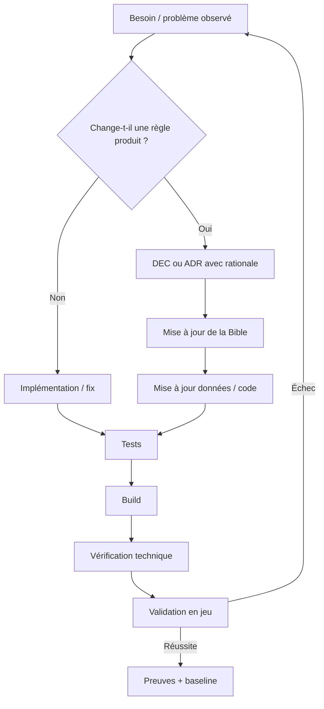
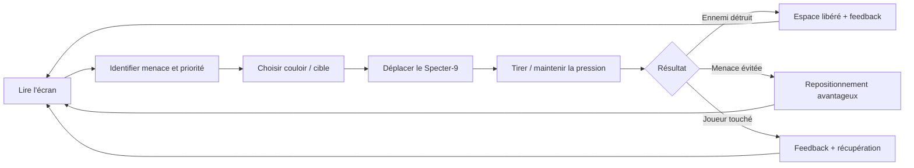
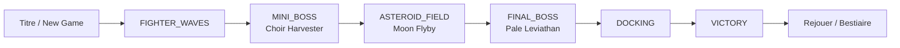
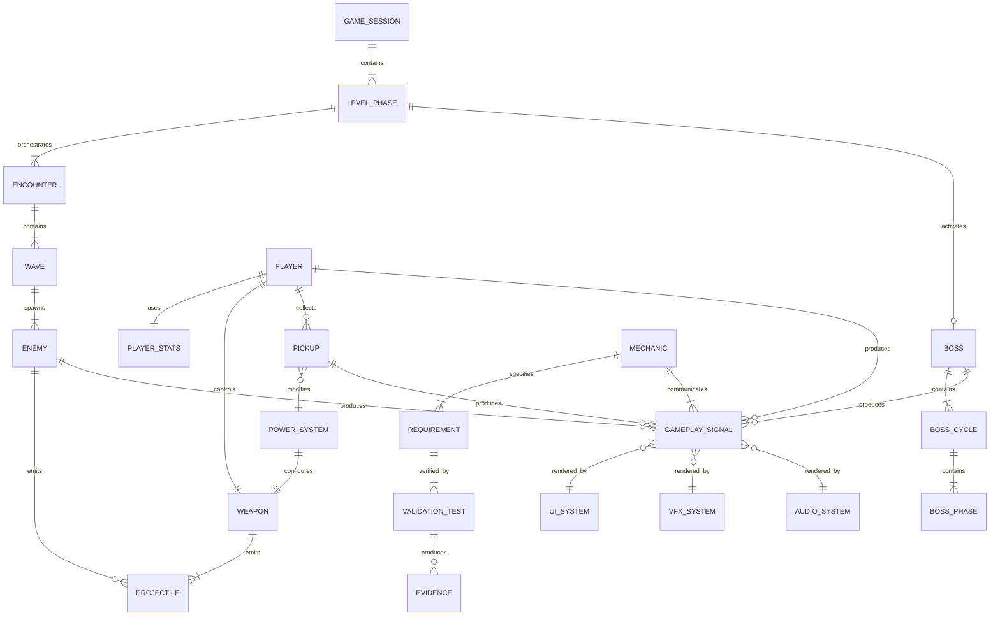
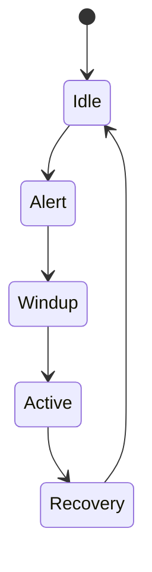
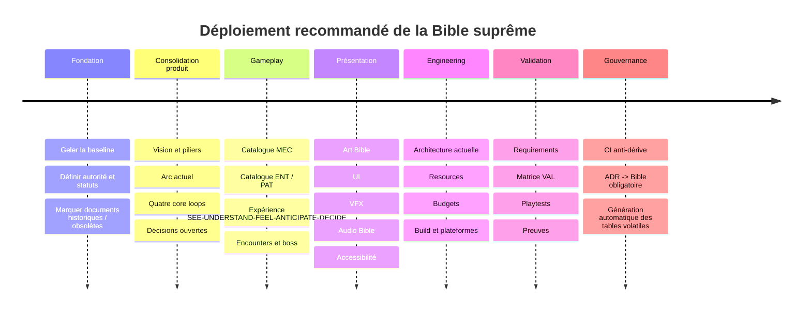

> ## ⚠️ Ce document est un rapport EXTERNE, importé tel quel
>
> - **Provenance** : rapport de recherche approfondie commandé par l'opérateur, remis le
>   **2026-08-27** (`deep-research-report.md`). Rédigé par un outil tiers à partir d'une lecture du
>   dépôt à la révision `f64f6cf`.
> - **Statut** : **PROPOSÉ**. Il n'a **aucune autorité** sur le projet. La hiérarchie de vérité reste
>   celle de `CLAUDE.md` : `SPEC → ADR (qui priment) → KB`. Ce rapport **recommande précisément d'en
>   changer** — c'est une décision d'opérateur qui n'est pas prise.
> - **Fidélité** : texte intégral. Seuls ont été retirés les marqueurs de citation de l'outil
>   d'origine (`…cite…`), illisibles et sans cible atteignable depuis le dépôt. Aucune
>   phrase n'a été modifiée, ajoutée ou coupée.
> - **Vérification** : ses affirmations factuelles sur le dépôt ont été contrôlées une par une le
>   2026-08-27 — voir le plan
>   [`docs/plans/2026-08-27-bible-supreme.md`](../plans/2026-08-27-bible-supreme.md), qui dit ce qui
>   est confirmé, ce qui est déjà fait, et ce qui reste à décider.
>
> **Ne pas traiter une ligne de ce document comme une consigne.** Ce qui en est retenu passe par le
> plan, puis par un ADR.

---

# Bible suprême d’Aegis Ascendant — audit, architecture et spécification recommandée

## Résumé exécutif

Au **27 août 2026**, sur la révision `main` `f64f6cf75c2d60c3bc3f752b5f5e180f8a89e894`, Aegis Ascendant possède déjà une quantité exceptionnellement riche de documentation : cahier des charges, ADR, architecture, bible du shoot'em up, base de connaissance, charte créative, briefs d'assets, données Godot typées, tests, règles de travail pour agents et dépôt de releases. Le problème n'est donc **pas un manque général de documentation**. Le problème est qu'il n'existe pas encore **une représentation unique, actuelle, normative et traçable du jeu**.

La preuve la plus importante est déjà dans le dépôt. Le `README.md` source décrit encore un arc incluant l'appontage, la prise de contrôle de la forteresse et le combat final depuis celle-ci, alors que l'ADR-0010 a explicitement supprimé ce changement de véhicule : le joueur doit piloter le Specter-9 du début à la fin et l'appontage est devenu la conclusion. La KB actuelle donne désormais l'arc `FIGHTER_WAVES → MINI_BOSS → ASTEROID_FIELD → FINAL_BOSS → DOCKING → VICTORY`. `CLAUDE.md` indique d'ailleurs explicitement que les ADR priment sur la spec en cas de divergence.

**Ma conclusion principale est donc très nette : Aegis n'a pas besoin d'un GDD supplémentaire. Il a besoin d'une “Bible suprême” qui devienne le contrat produit exécutable du jeu.**

Je recommande un document canonique :

```text
docs/BIBLE_AEGIS_ASCENDANT.md
```

avec cette propriété fondamentale :

> **À n'importe quel instant, une personne ou un agent doit pouvoir partir uniquement de la Bible, suivre ses références vers les données/code/tests lorsque nécessaire, et déterminer sans inventer : ce qu'est Aegis Ascendant, ce que le joueur doit vivre, comment chaque système doit se comporter, comment il doit communiquer son comportement, quelles contraintes doivent être respectées et comment prouver que le résultat est correct.**

Cette Bible ne doit pas recopier aveuglément toutes les valeurs volatiles du code. Elle doit être **la source de vérité des intentions, règles et contrats**, tandis que les valeurs exécutables très volatiles peuvent rester dans les Resources Godot, à condition d'être référencées et contrôlées automatiquement. Le dépôt fonctionne déjà largement selon un modèle data-driven avec Resources typées, `validate()`, composition, signaux et quality gate ; c'est donc techniquement compatible avec une Bible qui pilote réellement le développement.

La chaîne normative que je recommande est :

```text
VISION
   ↓
PILIERS
   ↓
EXPÉRIENCE JOUEUR
   ↓
MÉCANIQUES / RÈGLES
   ↓
ÉTATS + DONNÉES + INTERACTIONS
   ↓
SIGNAUX VISUELS / AUDIO / UI
   ↓
IMPLÉMENTATION
   ↓
EXIGENCES MESURABLES
   ↓
VÉRIFICATION TECHNIQUE + VALIDATION JOUEUR
   ↓
PREUVES
```

C'est cohérent avec le cadre MDA : le concepteur agit sur les mécaniques, qui créent les dynamiques à l'exécution, lesquelles produisent l'expérience ressentie ; le joueur parcourt cette chaîne dans l'autre sens. Cela justifie que la Bible ne décrive jamais une mécanique sans décrire simultanément **l'expérience qu'elle doit produire**.

Pour Aegis, j'ajouterais même une règle plus forte, directement issue des apprentissages du projet :

> **Une mécanique n'est pas spécifiée tant qu'on n'a pas spécifié ce que le joueur doit voir, comprendre, ressentir, anticiper et décider lorsqu'elle agit.**

Cette règle n'est pas théorique : la KB du projet documente cinq cas récents où un changement d'état existait réellement mais n'était pas correctement communiqué — freinage de la sangsue, champ protecteur, puits gravitique, sursis de mine, etc. Le dépôt en a tiré deux lois : un effet invisible ressemble à un défaut ; un signal mal compris est encore pire parce qu'il enseigne une règle fausse.

Enfin, il faut distinguer deux dimensions que `FIXED/CONSTRAINT/INTENTION/REFERENCE/TO_DECIDE` ne suffisent pas à représenter :

| Dimension | Valeurs | Question |
|---|---|---|
| **Force normative** | `FIXED`, `CONSTRAINT`, `INTENTION`, `REFERENCE`, `TO_DECIDE` | « À quel point dois-je obéir à ceci ? » |
| **État de preuve** | `VERIFIED`, `INFERRED`, `PROPOSED`, `OBSOLETE` | « Est-ce effectivement vrai dans le build actuel ? » |

Exemple :

```yaml
engine:
  value: Godot 4.7-stable
  normative: FIXED
  evidence: VERIFIED

fortress_player_control:
  value: false
  normative: FIXED
  evidence: VERIFIED
  supersedes: SPEC §6.6, §12
  source: ADR-0010

advanced_scoring_loop:
  value: null
  normative: TO_DECIDE
  evidence: PROPOSED
```

Cette seconde dimension aurait empêché une grande partie de la dérive documentaire actuelle.

## État réel du projet et dette documentaire

Le dépôt de releases demandé, `Happykiller/aegis-ascendant-releases`, est avant tout une **surface de distribution** : README public, assets de présentation et releases. La source de développement, les documents de conception et les Resources se trouvent dans `Happykiller/aegis-ascendant`. Le processus de release a d'ailleurs été créé précisément pour produire un exécutable Windows unique destiné aux testeurs.

La source actuelle confirme **Godot 4.7-stable**, Forward+, GDScript typé, résolution de viewport 1920×1080 et quatre autoloads principaux (`GameState`, `SceneRouter`, `SettingsManager`, `AudioManager`). Le preset de release cible Windows x86-64 et embarque le PCK dans l'exécutable.   Godot 4.7 supporte officiellement ce mode d'export, avec une limite de taille propre au PCK embarqué dans l'exécutable Windows.

**Ce qui existe déjà et ce qui manque à la Bible suprême :**

| Domaine | Existant dans le dépôt | Manque pour devenir « suprême » | Action proposée |
|---|---|---|---|
| **Autorité documentaire** | SPEC + ADR + KB + bible de genre + charte + code | Plusieurs vérités concurrentes et vieillissantes | **P0 — créer la hiérarchie canonique** |
| **Vision / promesse** | Vision et piliers très détaillés dans la SPEC | Un pilier historique concerne encore la transformation en forteresse supprimée | Rebaseliner la vision sur le jeu actuel |
| **Core loop** | Arc de partie actuel bien documenté dans la KB | Pas de contrat formel seconde-par-seconde / encounter / session / long terme | Formaliser les quatre échelles |
| **Mécaniques** | Beaucoup de systèmes, Resources, tests et règles | Pas de fiche homogène objectif→inputs→states→values→interactions→exceptions→signaux→tests | Catalogue `MEC-*` |
| **Enemies / patterns** | Bible genre excellente, bestiaire, patterns, télégraphie | Certaines conclusions sont datées et aucune taxonomie normative globale de pattern | Consolider + dater + référencer code/data |
| **Encounter design** | Vagues, boss, phase astéroïdes, règles d'introduction progressive | Progression de niveau encore orchestrée principalement par le director ; contrat encounter non uniforme | Catalogue `ENC-*` + timeline |
| **Player Experience** | Loi des signaux très forte | Pas appliquée systématiquement à chaque mécanique | Matrice SEE/UNDERSTAND/FEEL/ANTICIPATE/DECIDE |
| **Art Bible** | Charte créative, silhouettes, palettes exactes, VFX, pipeline, provenance | Manque bibliothèque canonique de bons/mauvais exemples et critères perceptifs par élément | Consolider en section normative + planches |
| **UI/UX** | HUD, règles de style, palette | Écart entre spécification historique et écrans réels ; règles d'accessibilité à formaliser | Contrats par écran et état |
| **Audio Bible** | Bus, banques, états musicaux, pipeline | Hiérarchie perceptive des sons critiques et spatialisation insuffisamment contractualisées | `AUD-*` + matrice de priorité |
| **Technique** | Très riche : architecture, Resources, pooling, build, conventions | Documents d'architecture datés ; budgets anciens à revérifier | Rebaseliner sur build courant |
| **Performance** | Budgets dans SPEC, profiler et règles de mesure | Statut « objectif » vs « réellement mesuré » pas assez visible | `BUD-*` + preuve attachée |
| **QA** | Tests unitaires/intégration, captures, soak, quality gate | Pas de traçabilité complète Requirement→Test→Evidence | Matrice `REQ-* ↔ VAL-*` |
| **Agents IA** | `CLAUDE.md`, forge, conventions, DoD | Pas de typage normatif `FIXED/...`, ni règle automatique contre la dérive documentaire | Contrat agent + CI documentaire |
| **Progression longue** | Score, rang de fin, bestiaire | Finalité de rejouabilité et métaprogression non décidées | **TO_DECIDE** |
| **Production** | Roadmap, backlog, ADR, briefs | Taille équipe, responsabilités humaines et échéances non spécifiées | Ne pas inventer ; afficher `UNSPECIFIED` |

Sources : SPEC et cahier technique.     Bible existante et KB.

Le `docs/design/bible/README.md` est particulièrement instructif : il affirme explicitement que sa bible actuelle **n'est pas la source de vérité produit** et que les états « chez nous » vieillissent. Cette prudence est excellente pour une base de connaissance, mais c'est précisément l'inverse de ce dont la Bible suprême a besoin : les éléments normatifs doivent être impossibles à confondre avec les références historiques ou recommandations de genre.

Autre dette importante : le document d'architecture technique consulté s'annonce lui-même comme reflétant l'état du **11 juillet 2026** et contient encore l'ancien flow avec forteresse jouable. La KB actuelle signale explicitement cette incohérence.

**Hypothèses qu'il ne faut surtout pas combler par invention :**

| Sujet | État après audit |
|---|---|
| Moteur | **SPÉCIFIÉ** — Godot 4.7-stable, Forward+  |
| Langage | **SPÉCIFIÉ** — GDScript typé  |
| Plateforme actuelle | **SPÉCIFIÉE** — Windows 10/11 x64  |
| Livrable testeur | **SPÉCIFIÉ** — `.exe` Windows autonome via PCK embarqué  |
| Machine principale de validation | **SPÉCIFIÉE** — Windows / RTX 4080 pour validation visuelle dans le workflow actuel  |
| Taille de l'équipe humaine | **UNSPECIFIED** |
| Responsable humain gameplay | **UNSPECIFIED** |
| Responsable humain art | **UNSPECIFIED** |
| Responsable humain audio | **UNSPECIFIED** |
| Responsable humain QA | **UNSPECIFIED** |
| Deadline de production | **UNSPECIFIED** |
| Date de sortie publique définitive | **UNSPECIFIED** |
| Support commercial à long terme | **UNSPECIFIED** |
| Autres plateformes futures | **UNSPECIFIED** |
| Métaprogression persistante | **UNSPECIFIED / TO_DECIDE** |
| Classement en ligne | Pas dans la cible actuelle ; aucune infrastructure produit à supposer |
| Manette dans le build release courant | Anciennes exigences existent, mais le README de release documente surtout le clavier : **à revalider**  |
| Budget perf machine secondaire réellement atteint | Objectif historique présent, preuve actuelle non trouvée : **à revalider**  |

La Bible doit rendre ces inconnues visibles. **`UNSPECIFIED` est une information valide.** C'est infiniment préférable à une décision inventée par un agent.

## Architecture de la Bible suprême

Je recommande de conserver **un seul document d'entrée canonique**, mais organisé comme une spécification de système plutôt que comme un roman de 200 pages. Chaque objet important reçoit un identifiant stable.

Les catégories minimales seraient :

```text
PIL-xxx   Pilier
EXP-xxx   Expérience joueur
LOOP-xxx  Boucle
MEC-xxx   Mécanique
PAT-xxx   Pattern
ENT-xxx   Entité
ENC-xxx   Encounter
LVL-xxx   Section de niveau
ART-xxx   Règle artistique
UI-xxx    Règle UI
AUD-xxx   Règle audio
TECH-xxx  Contrainte technique
BUD-xxx   Budget
REQ-xxx   Exigence
VAL-xxx   Validation
DEC-xxx   Décision ouverte
```

Une règle peut alors devenir :

```text
PIL-READABILITY
    ↓
EXP-THREAT-READING
    ↓
MEC-GRAVITY-WELL
    ↓
ART-FLOW-DIRECTION
AUD-GRAVITY-CUE
    ↓
REQ-GRAVITY-SIGNAL-VISIBLE
REQ-GRAVITY-SIGNAL-UNAMBIGUOUS
    ↓
VAL-GRAVITY-STATE-UNIT
VAL-GRAVITY-FIRST-PLAYTEST
```

Cela résout un défaut important des GDD classiques : ils décrivent beaucoup, mais il est difficile de déterminer **pourquoi** une ligne existe et **comment** on saura qu'elle est respectée.

**En-tête obligatoire de la Bible :**

```yaml
document: AEGIS_ASCENDANT_SUPREME_BIBLE
language: fr-FR
status: CANONICAL
bible_version: 1.0.0
game_version: 0.1.0
baseline_repository: Happykiller/aegis-ascendant
baseline_branch: main
baseline_commit: f64f6cf75c2d60c3bc3f752b5f5e180f8a89e894
engine: Godot 4.7-stable
target_platform: Windows 10/11 x64
last_verified: 2026-08-27
authority_owner: UNSPECIFIED
```

Le SHA ci-dessus correspond bien à la tête de `main` observée lors de cet audit.

**Ordre des blocs du document :**

| Bloc | Contenu |
|---|---|
| Identity | nom, genre, pitch, joueur cible, plateforme, durée cible, exclusions |
| Vision | fantasy, émotion, promesse, différenciation |
| Pillars | 3–5 lois non négociables |
| Experience | ce que le joueur doit percevoir/comprendre/ressentir/décider |
| Loops | micro, encounter, session, maîtrise/méta |
| Gameplay | contrôles, mouvement, combat, dégâts, mort, pickups, score |
| Mechanics Catalog | toutes les `MEC-*` |
| Patterns | grammaire des tirs, mouvements et compositions |
| Entities | joueur, bestiaire, boss, pickups, décor interactif |
| Encounters | construction, rythme, enseignement, combinaisons |
| Level | arc complet, chronologie, landmarks, respirations |
| Visual | art, silhouette, couleur, VFX, caméra, UI |
| Audio | musique, SFX, voix, mix, priorité |
| Accessibility | contraste, flash, shake, input, sous-titres |
| Technical | architecture, plateforme, données, build |
| Budgets | CPU/GPU/mémoire/projectiles/assets/audio |
| QA | exigences, tests, playtests, preuves |
| AI Production | contraintes des agents |
| Governance | décisions, changements, obsolescence |
| Open Decisions | tout ce qui reste `TO_DECIDE` |

**Hiérarchie d'autorité recommandée :**

```text
Bible suprême approuvée
        │
        ├── Resources / données runtime référencées
        │
        ├── tests et preuves
        │
        └── ADR = historique / rationale
```

C'est un changement important par rapport à aujourd'hui. Actuellement, `CLAUDE.md` établit `SPEC → ADR override → KB`.

Pour obtenir **réellement une seule source de vérité**, une ADR acceptée devrait désormais obligatoirement modifier la Bible dans le même changement. L'ADR continuerait d'exister pour expliquer **pourquoi** la décision a été prise, mais ne devrait plus être nécessaire pour connaître **l'état courant**.

En pratique :

```text
Avant :
SPEC dit A
ADR-0010 dit non-A
KB explique non-A
README dit encore A

Après :
BIBLE dit non-A
ADR-0010 explique pourquoi
anciens textes = historique / obsolète
```

C'est probablement **le changement le plus important de tout ce rapport**.

La Bible doit aussi éviter la duplication fragile. Par exemple, `MAX_BULLETS`, vitesse exacte, PV exacts ou timings doivent idéalement venir d'une Resource Godot ou d'une table générée lorsqu'ils changent fréquemment. La SPEC a déjà défini une architecture data-oriented et des Resources personnalisées pour les armes, projectiles, ennemis, encounters, boss, difficulté, audio et VFX.

Je recommande donc trois types de valeurs :

```yaml
value_type: NORMATIVE
value: 600
# La Bible impose 600 ; le runtime doit s'y conformer.

value_type: RUNTIME_SOURCE
source: res://resources/enemies/choir_mine.tres
property: arm_grace
# La valeur de la Resource fait foi ; la Bible explique son sens.

value_type: TO_DECIDE
value: null
# Aucun agent n'a le droit de choisir silencieusement.
```

**Flow de changement :**



Le dépôt dispose déjà d'une Definition of Done proche de ce modèle : `check.sh` vert, comportement vérifié, documentation/ADR à jour et commit propre.

## Gameplay, expérience, art et audio

**Les quatre core loops à graver dans la Bible**

Le loop seconde-par-seconde proposé pour le jeu actuel est :



Ce loop correspond aux priorités déjà documentées : combat lisible, projectiles lents/lisibles, télégraphie, priorité tactique de certaines unités et montée de puissance.

Le loop d'**encounter** devrait être normatif :

```text
INTRODUIRE
→ laisser identifier
→ laisser pratiquer
→ demander une première maîtrise
→ COMBINER avec une mécanique connue
→ intensifier
→ résoudre
→ respirer / récompenser
```

C'est déjà pratiqué dans le champ d'astéroïdes : mines seules, puis puits, puis sangsues, puis combinaison ; la bible de genre actuelle souligne explicitement cette construction.

Le loop de **session**, d'après la KB actuelle, est :



L'arc actuel est explicitement décrit dans la KB et l'ADR-0010 confirme que la forteresse n'est plus pilotée.

Le loop **long terme** est, lui, une vraie décision produit :

```text
DEC-LONGTERM-001
status: TO_DECIDE
```

Le projet possède déjà un score, un rang final et un bestiaire, mais sa propre bible constate que le scoring est actuellement essentiellement un compteur : pas de chain, pas de multiplicateur, pas de conflit risque/récompense et pas de difficulté dynamique de type rank. Elle pose justement la question fondamentale : **Aegis doit-il être rejoué pour le score ou traversé avant tout comme une expérience ?**

Tant que cette décision n'est pas prise, je n'intégrerais **aucun arbre de compétences, monnaie persistante, équipement ou grind** à la Bible. Le long loop le plus conservateur serait simplement :

```text
jouer
→ comprendre davantage les signaux et patterns
→ mieux maîtriser la route
→ améliorer survie / score / rang
→ enrichir sa connaissance du bestiaire
→ rejouer
```

mais il doit rester `PROPOSED`, pas être présenté comme une fonctionnalité acquise.

**Pour chaque mécanique, la Bible doit contenir deux contrats simultanés.**

Contrat système :

```text
OBJECTIVE
INPUTS
OUTPUTS
STATES
TRANSITIONS
VALUES
INTERACTIONS
EXCEPTIONS
EDGE CASES
```

Contrat joueur :

```text
SEE
UNDERSTAND
FEEL
ANTICIPATE
DECIDE
```

Exemple **Shield Carrier** :

| Question | Contrat recommandé |
|---|---|
| SEE | Le joueur distingue immédiatement le porteur et les unités bénéficiant de sa protection |
| UNDERSTAND | « Ces unités sont protégées par ce porteur » |
| FEEL | Une priorité tactique urgente, pas une panne de ses armes |
| ANTICIPATE | « Si je détruis le porteur, ces cibles redeviendront vulnérables » |
| DECIDE | Réorienter le feu vers le porteur |
| À ne jamais produire | « Je suis ralenti », « cette zone m'endommage », « mes tirs bugguent » |

Ce n'est pas une construction abstraite : le projet a réellement observé qu'un premier lien du porteur avait été mal lu comme un effet ralentissant le joueur. Le signal a ensuite été repensé pour utiliser **la direction du mouvement des points** comme porteur de sens.

Pour les signaux critiques, la redondance sensorielle devrait devenir une contrainte : Microsoft recommande que les informations essentielles de gameplay ne reposent pas sur un canal visuel ou sonore unique.

**Art Bible**

Le contenu de départ est déjà excellent. La charte créative fixe notamment :

- le ton : space opera militaire rétrofuturiste, stylisé et non photoréaliste ;
- les silhouettes principales ;
- les restrictions IP ;
- les formats et la provenance ;
- la règle UV obligatoire ;
- les palettes alliée/ennemie ;
- la réserve des couleurs de gameplay.

Les couleurs canoniques recensées sont notamment :

| Usage | Couleur |
|---|---:|
| Helios — blanc cassé | `#EDEAE3` |
| Helios — bleu profond | `#1C2B5E` |
| Helios — cyan | `#3FD9E8` |
| Helios — or | `#E4B54A` |
| Helios — rouge sécurité | `#C93A31` |
| Null Choir — anthracite | `#24252B` |
| Null Choir — violet sombre | `#452663` |
| Null Choir — ivoire froid | `#DDDCD2` |
| Null Choir — magenta | `#D93D9C` |
| Null Choir — vert limité | `#7C9E52` |

Ces valeurs sont déjà explicitement établies dans la charte.

La Bible suprême doit cependant ajouter des **tests perceptifs**, et pas seulement des couleurs :

```text
ART-PROJECTILE-ENEMY
FIXED:
- ne peut jamais être confondu avec un projectile allié
- ne peut jamais disparaître dans une explosion ou un décor
- doit posséder une forme / halo / trail adaptés
- sa taille visuelle doit rester cohérente avec la hitbox

VALIDATION:
- captures sur fonds les plus lumineux
- captures pendant explosion lourde
- capture à échelle 1:1
- mode contraste
```

Cette dernière exigence est particulièrement cohérente avec le dernier apprentissage capitalisé par le dépôt : un rendu avait été déclaré satisfaisant sur une capture réduite, alors qu'à 1:1 le défaut devenait évident ; le projet a créé `inspect-capture.py` précisément pour empêcher cette erreur de méthode.

Microsoft recommande également de tester explicitement le contraste des éléments essentiels du HUD et des indicateurs de gameplay contre leurs fonds et de ne pas dépendre uniquement de la couleur pour distinguer l'information.

**Audio Bible**

Le runtime possède déjà une bonne base : bus `Master`, `Music`, `SFX`, `Voice`, limiteur master à −0,5 dB, compresseur sur SFX et banques typées.  Le music bank contient plusieurs états correspondant à l'arc, dont launch, skirmish, fleet battle, docking, boss phases, final charge et victory.  La SPEC prévoyait déjà synthétiseurs analogiques, percussions orchestrales, basse électronique, montée héroïque et transitions musicales plutôt que coupures sèches.

Ce qui manque est une **hiérarchie de sens**.

Je recommande :

| Priorité | Exemple | Règle |
|---|---|---|
| **CRITICAL** | joueur touché, menace qui s'arme, bascule boss, état létal | Toujours perceptible dans le mix ; support visuel correspondant |
| **TACTICAL** | bouclier, pickup, cible prioritaire, fenêtre vulnérable | Doit faciliter une décision |
| **FEEDBACK** | tir joueur, impact, destruction courante | Satisfaction et confirmation |
| **SPECTACLE** | grosse explosion, flyby, décor | Peut être réduit si conflit avec gameplay |
| **AMBIENCE** | moteur lointain, environnement | Jamais prioritaire sur une information de jeu |

La règle audio fondamentale serait donc :

> **Le mixage suit la priorité gameplay, pas la taille physique de l'événement.**

Un météore énorme en arrière-plan ne doit pas masquer le son annonçant l'armement d'une mine proche.

Le statut de la **spatialisation gameplay détaillée** n'est pas suffisamment établi dans les sources examinées pour inventer une règle existante : elle doit donc entrer dans la Bible comme `TO_DECIDE` ou être vérifiée dans le code avant de devenir `VERIFIED`. Pour les sons hors écran qui transmettent une information critique, les recommandations d'accessibilité Xbox demandent par ailleurs qu'une information visuelle/caption équivalente puisse communiquer le son et, si pertinent, sa direction.

## Technique, systèmes et budgets

Le cœur technique actuel est suffisamment structuré pour alimenter directement la Bible : Godot 4.7, Forward+, GDScript typé, composition, signaux, Resources de données, pooling, dépendances explicites, validation de Resources et zéro allocation massive dans les boucles critiques.

La SPEC décrit un `BulletManager` data-oriented avec tableaux de positions/vitesses/rayons/équipes/TTL/dégâts, indices libres, MultiMesh, grille spatiale et collision swept pour les projectiles rapides. Les budgets historiques donnent 600 projectiles actifs, avec 150 alliés et 450 ennemis.

Il faut toutefois séparer clairement :

```text
BUDGET DÉCIDÉ
≠
BUDGET ACTUELLEMENT TENU
≠
BUDGET OBSERVÉ SUR UNE SEULE MACHINE
```

Je recommande donc ce format :

```yaml
id: BUD-BULLETS-001
name: Maximum active bullets

normative: CONSTRAINT
evidence: VERIFIED

target:
  total: 600
  ally: 150
  enemy: 450

runtime_source:
  path: scripts/projectiles/bullet_manager.gd

verification:
  method: automated_test
  evidence: tests/...

last_verified_commit: <sha>
```

Les anciens budgets de performance de la SPEC — par exemple 1440p/120 FPS sur RTX 4080 et 1080p/60 FPS sur une machine secondaire — sont utiles comme objectifs, mais ils doivent être **rebaselinés et marqués avec leur niveau de preuve**, car une valeur inscrite en 2026 dans un cahier des charges n'est pas automatiquement une mesure du build du 27 août.

La Bible doit conserver une distinction explicite :

```text
TARGET       ce que le jeu DOIT atteindre
MEASURED     ce qu'un build précis a réellement mesuré
MINIMUM      seuil bloquant
REFERENCE    point de comparaison non bloquant
```

Le dépôt a déjà développé une bonne philosophie de mesure : `CLAUDE.md` avertit que le FPS d'un lancement automatisé Windows ne constitue pas une mesure fiable dans ce workflow et recommande de mesurer le temps GPU par image.

**Modèle entité-relation des systèmes de jeu**

Le diagramme suivant ne prétend pas refléter classe pour classe tout le code ; il représente **le modèle canonique que la Bible devrait exposer** :



Le modèle est compatible avec l'architecture actuelle : le dépôt dispose déjà de ressources dédiées pour audio, bosses, codex, encounters, enemies, graphics, player, UI, VFX et weapons.

Les systèmes majeurs devraient posséder exactement le même squelette documentaire :

```text
PURPOSE
RESPONSIBILITIES
INPUTS / OUTPUTS
DEPENDENCIES
DATA
STATE MACHINE
EVENTS
PERFORMANCE BUDGET
FAILURE MODES
TESTS
EXTENSION POINTS
```

Cette philosophie est déjà présente dans la SPEC, qui demande pour chaque système majeur but, responsabilités, dépendances, diagramme, données, tests, limites et points d'extension.

Sur les assets, la Bible doit réutiliser la gouvernance existante plutôt que la remplacer : source/runtime/reference séparés, provenance, Git LFS, formats, UV et pipeline Blender/glTF.

Une contrainte particulièrement importante à conserver serait :

```text
FIXED — aucun asset généré ou forgé n'est "validé"
tant qu'il n'a pas été rendu dans le contexte réel du jeu
et examiné à l'échelle pertinente.
```

Le projet l'a déjà appris concrètement lors de plusieurs itérations de VFX et de coques.

## Validation, QA et règles pour agents IA

La Bible devrait utiliser rigoureusement la distinction **vérification / validation**.

NASA définit la vérification comme la confirmation qu'un produit satisfait les exigences spécifiées, par test, analyse, inspection ou démonstration. La validation cherche au contraire à déterminer si le produit est efficace et adapté à l'usage prévu dans des conditions réalistes, notamment avec des utilisateurs représentatifs.

Transposé au jeu :

```text
VÉRIFICATION
« La mine attend-elle réellement 1 s avant son engagement ? »

VALIDATION
« Un nouveau joueur comprend-il qu'il dispose d'un sursis
et qu'il peut ressortir de la zone ? »
```

Un test unitaire peut parfaitement prouver le premier et être totalement incapable de prouver le second. Le dépôt en donne une illustration frappante : plusieurs défauts d'expérience récents existaient malgré une porte de qualité verte, parce que la mécanique fonctionnait techniquement mais communiquait mal son état au joueur.

Chaque requirement devrait donc posséder une méthode :

```text
TEST
ANALYSIS
INSPECTION
DEMONSTRATION
PLAYTEST
```

NASA utilise déjà test/analyse/inspection/démonstration comme catégories classiques de V&V ; `PLAYTEST` est l'extension naturelle spécifique à un jeu lorsque la qualité à démontrer est perceptive ou expérientielle.

**Exemple de chaîne de preuve :**

```text
PIL-READABILITY
↓
EXP-MINE-001
Le joueur doit comprendre qu'entrer dans la portée prépare la mine
↓
MEC-CHOIR-MINE
↓
REQ-MINE-ARM-STATE
REQ-MINE-VISIBLE-GRACE
REQ-MINE-COMMIT-CLEAR
↓
VAL-MINE-STATE-UNIT
VAL-MINE-SIGNAL-CAPTURE
VAL-MINE-FIRST-PLAYTEST
↓
test log + screenshot + build + observation
```

La SPEC possède déjà une stratégie de tests unitaires, intégration, soak, captures visuelles et quality gate.  Ce qui manque principalement est cette **traçabilité bidirectionnelle**.

Je recommande que le quality gate vérifie aussi la documentation :

```text
[ ] aucun MEC-* FIXED sans REQ-*
[ ] aucun REQ-* critique sans VAL-*
[ ] aucun VAL-* marqué PASS sans preuve
[ ] aucune référence de Resource inexistante
[ ] aucun TO_DECIDE implémenté silencieusement comme décision produit
[ ] toute ADR acceptée modifie la Bible
[ ] aucune section OBSOLETE présentée comme CURRENT
[ ] baseline commit valide
[ ] tables générées synchronisées avec les Resources
```

**Contrat des agents IA**

La classification souhaitée devrait être appliquée à chaque instruction importante :

| Tag | Comportement obligatoire de l'agent |
|---|---|
| `FIXED` | Respect exact. Changement interdit sans décision explicite |
| `CONSTRAINT` | Liberté dans les limites indiquées |
| `INTENTION` | Résultat imposé, solution technique libre |
| `REFERENCE` | Inspiration, jamais obligation |
| `TO_DECIDE` | Interdiction d'inventer une décision permanente |

J'ajouterais les états de preuve :

| Tag | Signification |
|---|---|
| `VERIFIED` | Vérifié dans code/data/build/test actuel |
| `INFERRED` | Déduit de sources mais pas confirmé directement |
| `PROPOSED` | Proposition non encore acceptée |
| `OBSOLETE` | Ancienne vérité conservée uniquement pour historique |

Et deux règles supplémentaires qui devraient être **FIXED** :

```text
FIXED: L'absence d'information n'autorise pas l'invention.

FIXED: Une solution techniquement fonctionnelle n'est pas terminée
si elle ne produit pas l'expérience joueur spécifiée.
```

`CLAUDE.md` impose déjà l'interdiction d'inventer une API Godot et demande de vérifier la documentation officielle 4.7 ; cette même discipline doit être généralisée aux décisions de design.

Microsoft recommande par ailleurs de considérer les mécanismes d'entrée, leur vitesse, leur timing et leur complexité, ainsi que de fournir des alternatives configurables lorsque pertinent.  Les XAG sont explicitement présentées comme des garde-fous pour les développeurs et des checklists de validation ; elles sont donc très adaptées comme **REFERENCE externe**, mais elles ne doivent pas être confondues avec les exigences produit Aegis tant que celles-ci n'ont pas été adoptées dans la Bible.

C'est exactement la bonne utilisation du tag `REFERENCE`.

## Modèles Markdown prêts à intégrer

**Template d'une mécanique**

```markdown
# MEC-XXX — <Nom de la mécanique>

normative: FIXED | CONSTRAINT | INTENTION | REFERENCE | TO_DECIDE
evidence: VERIFIED | INFERRED | PROPOSED | OBSOLETE
owner: UNSPECIFIED
last_verified_commit: <sha>
sources:
  - <fichier / ADR / Resource / code>

## Intention

Pourquoi cette mécanique existe.
Quelle valeur elle apporte à l'expérience.

## Piliers liés

- PIL-...
- PIL-...

## Expérience joueur

| Dimension | Contrat |
|---|---|
| SEE | Ce que le joueur doit percevoir |
| UNDERSTAND | La règle qu'il doit en déduire |
| FEEL | Ce qu'il doit ressentir |
| ANTICIPATE | Ce qu'il doit pouvoir prévoir |
| DECIDE | La décision que la mécanique doit provoquer |

## Objectif système

<résultat fonctionnel>

## Inputs

| Input | Type | Source | Conditions |
|---|---|---|---|
| ... | ... | ... | ... |

## Outputs

| Output | Type | Consommateur |
|---|---|---|
| ... | ... | ... |

## États



## Valeurs

| Paramètre | Unité | Source de vérité | Valeur / plage | Statut |
|---|---:|---|---:|---|
| ... | s | `res://...tres` | ... | RUNTIME_SOURCE |
| ... | m | Bible | ... | CONSTRAINT |

Ne jamais recopier manuellement une valeur volatile si sa Resource
est la source runtime officielle.

## Interactions

- MEC-...
- ENT-...
- ENC-...

## Exceptions et cas limites

- ...
- ...

## Signaux

| Événement | Visuel | Audio | UI | Autre |
|---|---|---|---|---|
| Alert | ... | ... | ... | ... |
| Commit | ... | ... | ... | ... |
| Hit | ... | ... | ... | ... |

Pour tout événement critique :
- le joueur peut-il voir qu'il se produit ?
- peut-il en déduire la BONNE règle ?

## Contraintes techniques

- Performance :
- Allocation :
- Pooling :
- Collision :
- Data :
- Accessibilité :

## Requirements

- REQ-...
- REQ-...

## Validation

- VAL-...
- VAL-...

## Décisions ouvertes

- DEC-... — TO_DECIDE

## Changelog

- YYYY-MM-DD — ...
```

**Template d'un test de validation**

```markdown
# VAL-XXX — <Nom>

linked_requirements:
  - REQ-XXX

linked_mechanics:
  - MEC-XXX

method:
  TEST | ANALYSIS | INSPECTION | DEMONSTRATION | PLAYTEST

status:
  NOT_RUN | PASS | FAIL | BLOCKED

build:
  version: <version>
  commit: <sha>
  platform: <platform>

## Intention

Ce que l'on cherche réellement à garantir.

## Règle

La règle normative provenant de la Bible.

## Implémentation attendue

Ce qui doit exister pour réaliser la règle,
sans imposer une solution non nécessaire.

## Préconditions

- ...
- ...

## Procédure

1. ...
2. ...
3. ...

## Mesures

| Mesure | Valeur | Seuil | Résultat |
|---|---:|---:|---|
| ... | ... | ... | PASS/FAIL |

## Validation perceptive

Pour un playtest :

- Qu'a vu le joueur ?
- Qu'a-t-il compris ?
- Qu'a-t-il cru que le système faisait ?
- Qu'a-t-il anticipé ?
- Quelle décision a-t-il prise ?
- A-t-il appris une règle incorrecte ?

## Critères d'acceptation

- [ ] ...
- [ ] ...
- [ ] ...

Toute valeur quantitative non décidée reste `TO_DECIDE`.
Ne jamais inventer un seuil pour faire passer le test.

## Evidence

- capture:
- log:
- profiler:
- vidéo:
- témoignage playtest:

## Résultat

PASS | FAIL | BLOCKED

## Commentaire

...
```

**Exemple concret de validation Aegis :**

```markdown
# VAL-CHOIR-HARVESTER-READABILITY

linked_mechanics:
  - MEC-CHOIR-HARVESTER-IRIS

method: PLAYTEST

## Intention

Le joueur comprend que tirer sur l'iris fermé est inefficace
et qu'il doit exploiter l'ouverture.

## Règle

Un tir dévié doit produire un retour perceptible.
L'ouverture doit constituer un événement clairement distinct.

## Critères

- [ ] Le joueur remarque une différence entre fermé et ouvert.
- [ ] Le joueur peut expliquer que l'état fermé protège le boss.
- [ ] Le joueur identifie l'ouverture comme fenêtre d'attaque.
- [ ] Aucun signal ne lui fait conclure que son arme est défectueuse.

## Seuil statistique

TO_DECIDE
```

Ce cas reflète directement le design documenté du Choir Harvester : les tirs sur la carapace fermée doivent produire un feedback explicite plutôt que « ne rien faire », et l'ouverture du noyau est annoncée.

**Timeline recommandée pour construire la Bible sans arrêter le développement**



## Priorités, charge et références

L'effort ci-dessous est **relatif**, pas une estimation calendaire : la taille de l'équipe, sa disponibilité et ses responsabilités ne sont pas spécifiées. `Faible` signifie essentiellement consolidation locale ; `Moyen`, analyse/transversalité ; `Élevé`, inventaire ou transformation structurante multi-domaines.

| Priorité | Livrable | Effort | Owner |
|---|---|---:|---|
| **P0** | Définir `BIBLE_AEGIS_ASCENDANT.md` comme autorité canonique | Faible | Non spécifié |
| **P0** | Rebaseliner SPEC + ADR + KB + README sur l'état réel actuel | **Élevé** | Non spécifié |
| **P0** | Supprimer/étiqueter l'ancienne forteresse jouable partout où elle apparaît encore comme actuelle | Moyen | Non spécifié |
| **P0** | Écrire Vision + piliers actuels sans héritage obsolète | Moyen | Non spécifié |
| **P0** | Formaliser les quatre core loops | Faible | Non spécifié |
| **P0** | Construire le catalogue `MEC-*` complet à partir des Resources/code | **Élevé** | Non spécifié |
| **P0** | Ajouter SEE/UNDERSTAND/FEEL/ANTICIPATE/DECIDE à chaque mécanique critique | **Élevé** | Non spécifié |
| **P0** | Construire la matrice `REQ-* ↔ VAL-* ↔ Evidence` | **Élevé** | Non spécifié |
| **P0** | Formaliser `FIXED/CONSTRAINT/INTENTION/REFERENCE/TO_DECIDE` | Faible | Non spécifié |
| **P0** | Ajouter `VERIFIED/INFERRED/PROPOSED/OBSOLETE` | Faible | Non spécifié |
| **P0** | Interdire une ADR acceptée sans update de la Bible | Moyen | Non spécifié |
| **P1** | Normaliser bestiaire + patterns + priorité de cibles | Moyen | Non spécifié |
| **P1** | Formaliser chaque encounter et ses objectifs d'apprentissage | Moyen | Non spécifié |
| **P1** | Transformer la charte créative en Art Bible normative avec exemples autorisés/interdits | Moyen | Non spécifié |
| **P1** | Ajouter une bibliothèque de captures de référence 1:1 | Moyen | Non spécifié |
| **P1** | Créer la matrice de signaux visuels/UI/audio | Moyen | Non spécifié |
| **P1** | Écrire la hiérarchie Audio Critical/Tactical/Feedback/Spectacle/Ambience | Moyen | Non spécifié |
| **P1** | Revalider spatialisation et masking audio | Moyen | Non spécifié |
| **P1** | Rebaseliner budgets CPU/GPU/projectiles/assets sur build actuel | **Élevé** | Non spécifié |
| **P1** | Formaliser accessibilité : input, contrastes, shake, flash, sous-titres | Moyen | Non spécifié |
| **P1** | Générer automatiquement certaines tables Bible depuis `.tres` | **Élevé** | Non spécifié |
| **P1** | Ajouter un contrôle de dérive documentaire à `check.sh` | Moyen | Non spécifié |
| **P2** | Décider si Aegis est une expérience à parcourir ou un shmup à score/replay profond | Moyen | Non spécifié |
| **P2** | En déduire la progression longue / scoring avancé | **Élevé** si retenu | Non spécifié |
| **P2** | Consolider lore/codex/glossaire | Faible | Non spécifié |

### Références Aegis les plus importantes

La baseline analysée est le dépôt source :

`https://github.com/Happykiller/aegis-ascendant`

et le dépôt public de distribution demandé :

`https://github.com/Happykiller/aegis-ascendant-releases`

Le `CLAUDE.md` source définit aujourd'hui l'ordre de vérité, les conventions, le workflow WSL/Windows, le quality gate, la provenance des assets et les règles principales de travail des agents.

Le cahier des charges reste la plus grande réserve de matière pour vision, gameplay, art, audio, architecture, performances, QA et production, mais certaines de ses décisions sont désormais superseded par les ADR.

L'ADR-0010 est essentiel à la consolidation parce qu'il supprime explicitement la transformation en forteresse et rend le Specter-9 permanent.

La KB `arc-de-jeu.md` est actuellement la description la plus claire du flow de partie effectif et documente également la dérive de l'architecture historique.

`signaux.md` devrait quasiment être élevé au rang de pilier de la Bible : il matérialise un apprentissage produit issu du playtest plutôt qu'une règle théorique.

La charte créative constitue une excellente base de l'Art Bible, avec canon, palettes, silhouettes, IP, formats et pipeline.

### Références externes et exemples Sonic

Le **Sonic the Hedgehog (and his pals) Official Stylebook & Character Manual** de 1994 est un bon exemple du niveau de précision qu'un guide de licence peut atteindre : personnages, logos, artwork et règles de représentation. La copie publique disponible est un scan d'un document destiné aux licenciés, pas une publication publique actuelle de Sega.

Lien d'archive :

`https://archive.org/details/sonic-usstyleguide-1994`

Le **Sonic Adventure Stylebook**, utilisé pour la promotion et le merchandising autour de l'époque Dreamcast, est également documenté dans des archives publiques.

Archive du Character Manual / Stylebook :

`https://archive.org/details/sonic-the-hedgehog-character-manual-official-stylebook-binder-scan-disc-extraction.-7z`

Le **Modern Sonic Style Guide** montre l'évolution vers une charte beaucoup plus systématique : patterns, backgrounds, usages graphiques et ressources délivrées dans un processus d'approbation. Il s'agit là encore d'une copie publique d'un guide de licensing, et non d'une documentation Sega actuellement distribuée publiquement.

`https://www.scribd.com/document/815739602/Modern-Sonic-Styleguide-Lr`

Enfin, pour les 30 ans de Sonic, Design Force indique explicitement avoir travaillé avec Sega of America sur un style guide comprenant logo, graphismes composés, patterns et déclinaisons destinées aux activations de la marque. C'est un exemple moderne et directement attribué du rôle d'une bible visuelle dans la cohérence d'une IP.

`https://designforceinc.com/projects/sonic-the-hedgehog-30th-anniversary-style-guide/`

La leçon à reprendre de Sonic n'est toutefois **pas de faire uniquement un style guide**. Un guide de licence est extraordinairement bon pour répondre à :

```text
À quoi Sonic doit-il ressembler ?
Comment sa marque doit-elle être utilisée ?
Quelles couleurs, poses, proportions et compositions sont acceptables ?
```

Il ne répond pas à l'ensemble des questions dont Aegis a besoin :

```text
Pourquoi cette mécanique existe-t-elle ?
Comment ses états se combinent-ils ?
Que doit comprendre le joueur ?
Quelle donnée en est l'autorité ?
Quel budget a-t-elle ?
Comment la tester ?
Comment prouver que l'expérience obtenue est correcte ?
Que peut décider un agent et que doit-il escalader ?
```

La **Bible suprême Aegis** doit donc être, conceptuellement :

> **Sonic Style Guide**
> + **Game Design Bible**
> + **System Specification**
> + **Art & Audio Bible**
> + **Technical Design Document**
> + **Requirements Traceability Matrix**
> + **Validation Plan**
> + **Agent Operating Contract**.

Le cadre MDA fournit une base solide pour relier mécaniques, comportements émergents et expérience désirée.  La discipline V&V fournit une base rigoureuse pour relier exigence et preuve.  Les Xbox Accessibility Guidelines offrent un catalogue actuel de critères de perception, input, contraste et signaux multicanaux à utiliser comme références de validation.

Le résultat cible peut ainsi se résumer en une formule :

```text
Une décision n'est pas canonique
si elle n'est pas dans la Bible.

Une mécanique n'est pas complète
si son expérience joueur n'est pas définie.

Une exigence n'est pas utile
si elle n'est pas vérifiable.

Une fonctionnalité n'est pas validée
parce que le code fonctionne :
elle l'est lorsque le build produit
l'expérience spécifiée et que la preuve existe.
```

C'est précisément le niveau de contrat qu'il faut à Aegis Ascendant pour que la Bible soit réellement **la référence unique permettant de concevoir, implémenter, auditer et valider le jeu sans laisser les humains ni les agents IA compléter les blancs par interprétation**.